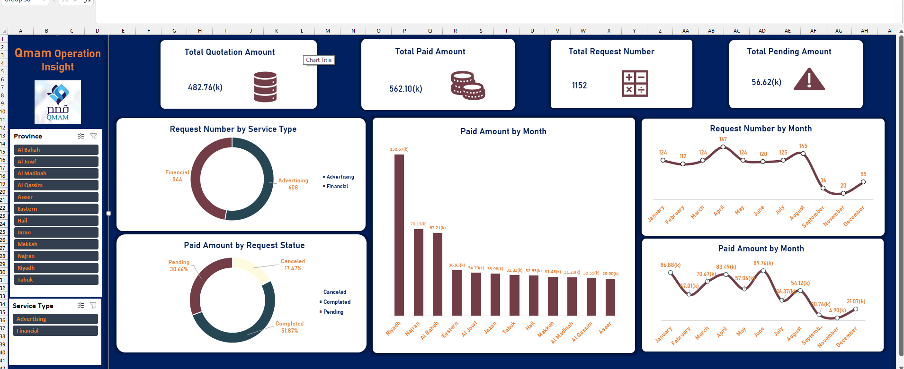

# Qmam Operation Dashboard

## 📊 Project Overview

An interactive Excel dashboard designed to analyze Oman operations data, service requests, paid amounts, pending amounts, and monthly performance.

## 🛠️ Tools Used

- Microsoft Excel
- Pivot Tables
- Charts
- Data Analysis
- Dashboard Design

## 📈 Key Analysis

- Total Quotation Amount
- Total Paid Amount
- Total Request Number
- Total Pending Amount
- Request Number by Service Type
- Paid Amount by Request Status
- Paid Amount by Month
- Request Number by Month
- Province Analysis
- Service Type Analysis

## 📁 Project File

The complete Excel workbook is included in this repository.

## 📷 Dashboard Preview

